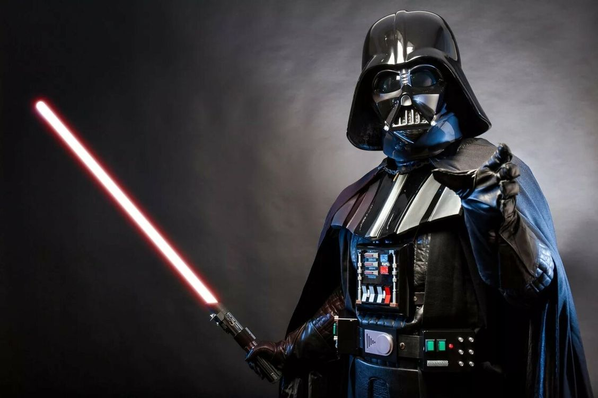

# Обо мне 

Меня зовут *Энакин Скайуокер*, но все знаю меня как ***Дарт Вейдер***.

Я родился на татуине. Никогда не знал отца, мама погибла. 

В детстве был рабом. Занимался робототехникой, создал искуственный интелект, разговаривающий на тысячах языков и установил его в дройда. 

Чемпион планеты *Татуин* в гонках на космокораблях. 

Участник подавления восстания Торговой федерации, Войнах клонов

## Семья

Был женат на *Падме Амидала*, экс-королеве Набу и сенаторе Галактической республике. Она умерла во время родов.

Двое детей: *Люк* и *Лея* - близнецы.

## Образование

**Орден джедаев.** Курс от падавана до магистра. 

## Место работы

* Падаван Оби-Вана Кеноби

* Рыцарь-джедай в Галактической республике

* Лорд Ситхов, командующий войсками Галактической империи

